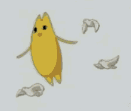

# 
Ay there! ｜ よ！

    
    
    
    

---

# Computer languages ｜ 話せるパソコン言語：
### Definitely ｜ もちろん
- Nix
- Python
### Sorta｜ ちょっと
- C++
- C
- Rust
### Want to learn｜学びたい
- AMD64 assembly
- Low level programming in general
- Kotlin

---

# Human languages ｜ 話せる人間言語：
### Definitely ｜ もちろん
- English - 🇺🇲
### Sorta｜ ちょっと
- Japanese - 🇯🇵
### Want to learn｜学びたい
- Russian - 🇷🇺
- Korean - 🇰🇷
- Chinese - 🇹🇼
- French - 🇫🇷
- German - 🇩🇪
- Hebrew - 🇮🇱
---

# About me｜自己紹介：

Dumb "programmer" that doesn't do much besides report bugs and publish configs and scripts. I technically know Python, Nix the best, then a bit of C++, C, and Rust. I have deep intrest in Linux, computers, anime, video games, and other cultures. I am 18 years old and live in the States in the middle of nowhere in the southern United States. I run NixOS on my desktop.

---

ぼくは馬鹿なプログラマーんですよね、普段でバグを報告して設定を投稿する。ぼくはPythonとNixが一番よく知っている、さらにC++、C、C++が知っているです。趣味はLinux、パソコン、アニメ、、ビデオゲーム、海外の文化ですよね。ぼくは１８歳です、アメリカ南部に積んでいる。パソコンでNixOSを使用している。

---

    
